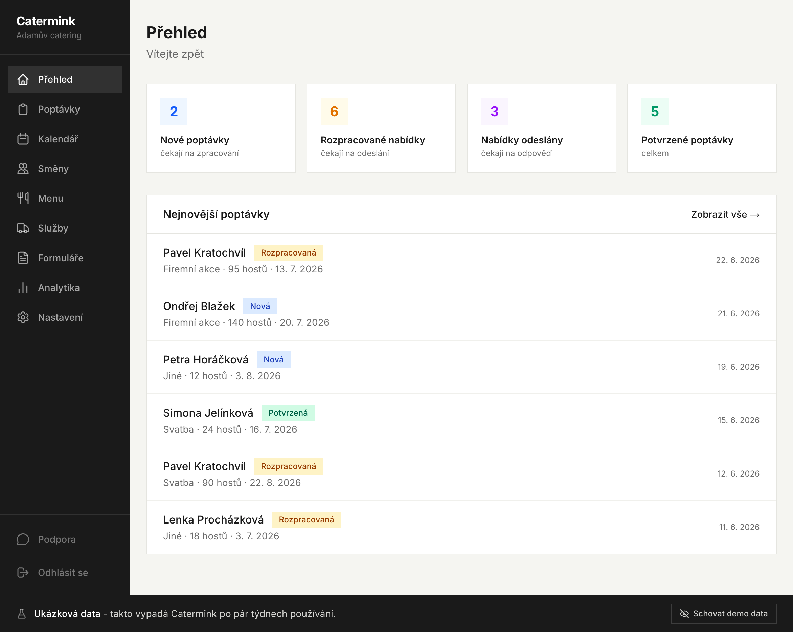
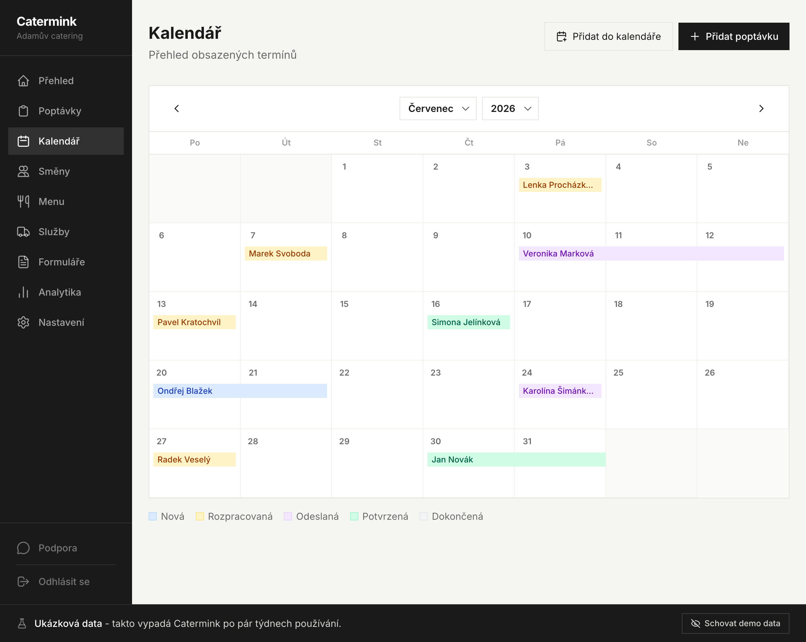
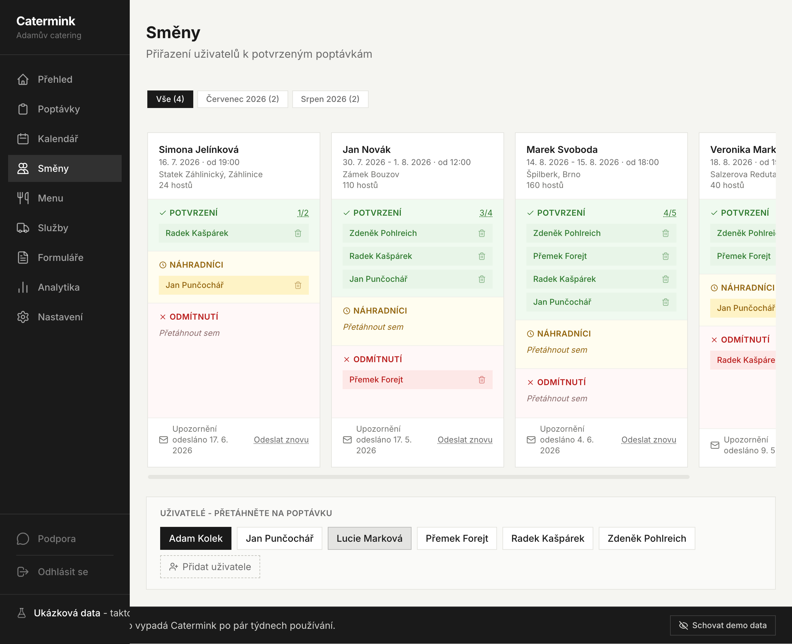
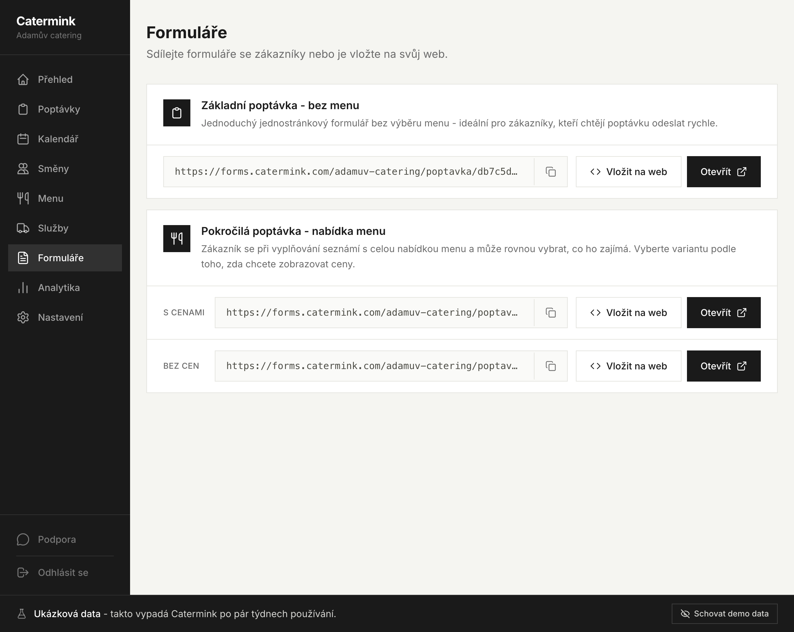
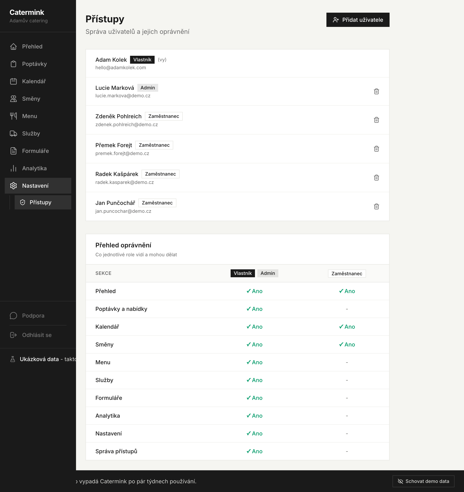
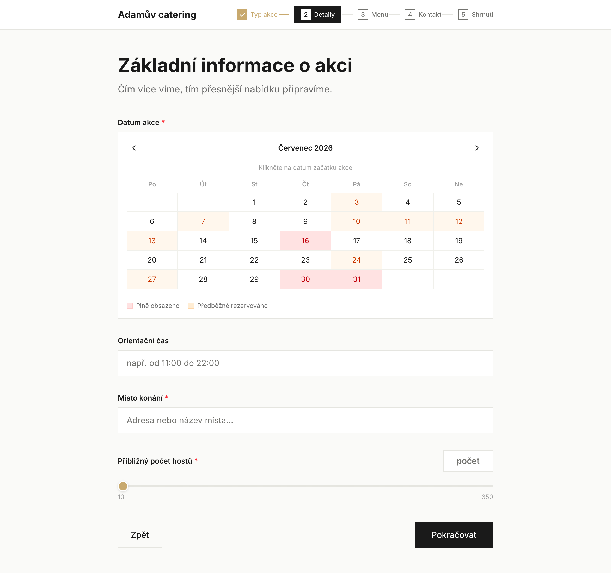
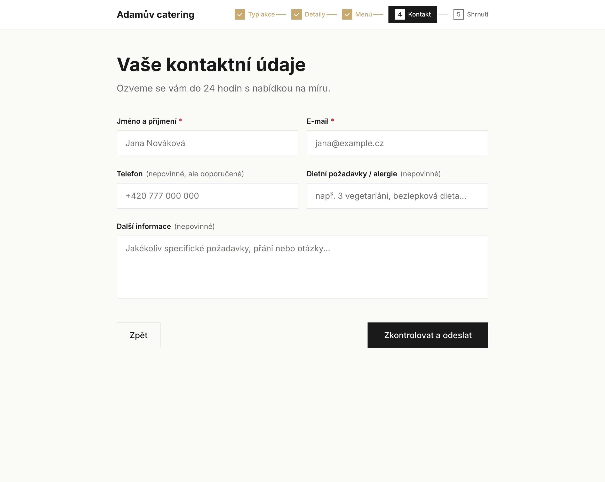

# Catermink — Case Study

← [Back to profile](./README.md)

> How I designed and built **[Catermink](https://catermink.com)** — a multi-tenant system that runs the back office for catering businesses. This is a high-level architecture write-up; the product source is private.

## The problem

Caterers juggle inquiries, quotes, events, clients and staff across spreadsheets, inboxes and paper. The work is bursty and deadline-driven, and a missed detail costs a booking. Catermink replaces that patchwork with one system built around how catering actually runs.

## What Catermink is

A web application where each catering business gets its own isolated workspace covering:

- **Inquiries** — public, multi-step forms feed straight into the pipeline.
- **Quotes** — branded PDF offers with automatic numbering.
- **Menu & services** — a reusable catalogue of dishes and add-ons (labour, transport, rentals) that powers both the offer builder and the public forms.
- **Calendar & events** — bookings by status, with sync to Google, Apple and Outlook via ICS.
- **Staff** — shift planning with confirmations, substitutes and role-based access.
- **Automated email** — confirmations, staff notifications and password resets, sent through Resend.

## Architecture

- **Tenant isolation by default.** Every record is scoped to a tenant, so data never leaks across workspaces. Tenant resolution runs in a request proxy, before any route handler executes.
- **Domain isolation.** The authenticated admin app and the public inquiry forms run on separate subdomains (`admin.` and `forms.`), each with its own trust boundary; the marketing site is a separate codebase.
- **Role-based access.** Three levels — owner, admin and staff — gate what each user can see and do inside a workspace.
- **Auth.** Stateless, token-based sessions verified on every request.
- **Documents.** Quotes are rendered to PDF server-side from structured data.

## The stack

- **Next.js 16 (App Router) + React 19** — one framework for the marketing surface, the authenticated app and the API, with server components keeping the client bundle lean.
- **Turso / libSQL + Prisma** — SQLite semantics with a hosted, replicated edge database. Local development runs against a file; production runs against Turso. Prisma gives typed access and predictable migrations.
- **Sentry** — errors and performance traced across the whole app, so production issues surface with context instead of guesswork.
- **Vercel** — preview deploys per branch and a clean path from staging to production.
- **TypeScript + Zod throughout** — strict types in code, runtime validation at the boundaries, no `any` in app code.

## Why these tradeoffs

- **libSQL over a classic Postgres host** — edge-replicated reads and a frictionless local story mattered more than heavyweight relational features the product doesn't need yet.
- **Subdomain isolation over a single app** — clearer trust boundaries and independently cacheable surfaces, at the cost of a bit more routing plumbing.
- **Custom token sessions over a managed auth vendor** — full control over the multi-tenant session shape, with no per-seat vendor pricing as tenants grow.

## Screenshots

_All screenshots use demo data._

**Bookings calendar** — every event colour-coded by status (new, in progress, sent, confirmed, done).

**Staff scheduling** — drag people onto a confirmed event; track who's confirmed, who's a substitute, and who declined.

**Shareable inquiry forms** — copy a link or embed a form on the caterer's own site, with or without prices.

**Roles & permissions** — owner, admin and staff, each with a clearly scoped permission matrix.

**The public inquiry form** — guests pick a date (with live availability), time, location and headcount…

…and finish with their contact details. The caterer receives a structured lead instead of a vague email.

## Status

Live in production with real catering businesses, backed by a separate staging environment and a dedicated QA workflow.

---

Built by **Adam Kolek** · [catermink.com](https://catermink.com) · adam@catermink.com
